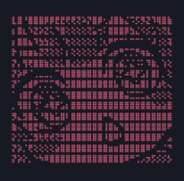

 
> Hi, I'm **Surya Hadini .S**

> Live In **West Java, Indonesia**

> Studying **Fullstack Developer, CyberSecurity**

> I'm using **Windows, Linux**

> My Skill **HTML, CSS, JavaScript, PHP, Python, Java, C/C++**

> Understand **Bahasa Indonesia, Sundanese, English**

 
 

 
<a href=https://github.com/sansxpl/S3X-Webshell>
 [***sansxpl/S3X-Webshell***]()
<a>

 
 

  

