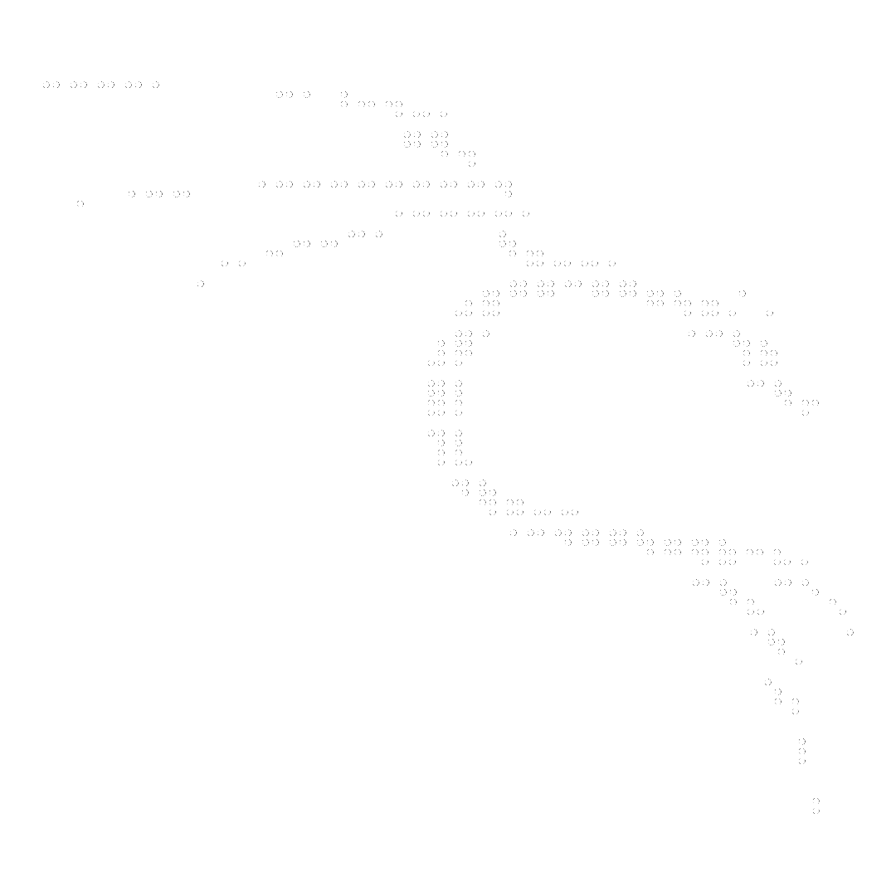

 

 
> Hi, I'm **SANS**

> Live In **IDN**

> Studying **Fullstack Developer, CyberSecurity**

> I'm using **Windows, Linux**

> My Skill **HTML, CSS, JavaScript, PHP, Python, Java, C/C++**

> Understand **Bahasa, English**

> 

 

 
> [***exphert/shanghai ◊***](https://github.com/exphert/shanghai)  
 Shanghai is an automated bot for adding contacts to a WhatsApp group.  
> [***exphert/simple-shortlink ◊***](https://github.com/exphert/simple-shortlink)  
 Simple Shortlink is a basic URL shortening service that allows you to create and manage short URLs.  
> [***exphert/easy-gitpush ◊***](https://github.com/exphert/easy-gitpush)  
 Effortlessly push your code changes with a single script. Simplify your Git workflow and save time!  

 

 

<!--img src="https://media1.tenor.com/m/wfBrR397QusAAAAd/cyberpunk-cyberpunk-2077.gif" /-->

